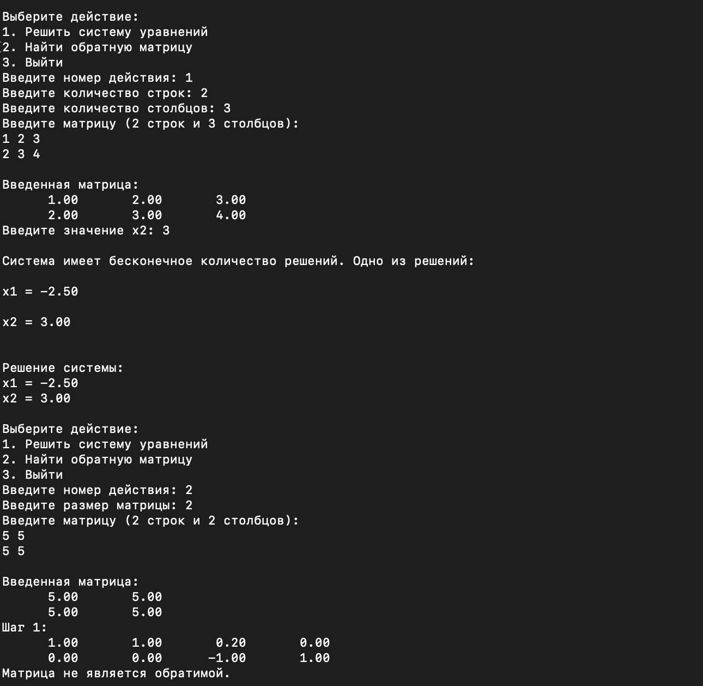
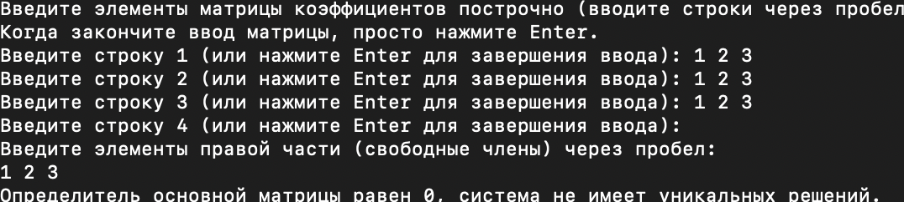

## English

### Matrix Operations Program

This program allows you to perform two main operations on matrices: solving systems of linear equations and finding the inverse of a matrix. It uses the Gaussian elimination method for solving equations and a similar approach for finding the inverse.

## Screenshots




### Features

1. **Solve a System of Linear Equations**: 
   - Input a matrix of coefficients and the corresponding constants.
   - The program handles cases with no solution or infinite solutions.
   - You can provide a specific value for one of the variables.

2. **Find the Inverse of a Matrix**: 
   - Input a square matrix.
   - The program checks if the matrix is invertible and computes the inverse if possible.

### Requirements

- Python 3.x
- NumPy library

### How to Use

1. **Install Dependencies**:
   Ensure you have Python 3.x installed. You can install the NumPy library using pip:
   ```bash
   pip install numpy
   ```

2. **Run the Program**:
   Execute the program by running:
   ```bash
   python matrix_operations.py
   ```

3. **Choose an Operation**:
   - Select an operation (1 to solve equations, 2 to find an inverse, or 3 to exit).
   
4. **Input the Necessary Matrices**:
   Follow the prompts to input the matrices as required.

### Example

To solve a system of equations represented by the matrix:
```
1 2 | 3
4 5 | 6
```
Input:
```
2
3
1 2
4 5
```

To find the inverse of a matrix:
```
1 2
3 4
```
Input:
```
2
1 2
3 4
```

### License

This project is open source and available under the MIT License.

**Note:**
We have a code editor "VS Code", download it and install Python. (You can Google it)
By pressing Ctrl Shift + on your keyboard. A terminal will open. Everything shown above must be entered into the terminal.

---

## Русский

### Программа для работы с матрицами

Эта программа позволяет выполнять две основные операции с матрицами: решать системы линейных уравнений и находить обратную матрицу. Она использует метод Гаусса для решения уравнений и аналогичный подход для нахождения обратной.

### Возможности

1. **Решение системы линейных уравнений**:
   - Ввод матрицы коэффициентов и соответствующих констант.
   - Программа обрабатывает случаи без решений или с бесконечным количеством решений.
   - Вы можете задать конкретное значение для одной из переменных.

2. **Нахождение обратной матрицы**:
   - Ввод квадратной матрицы.
   - Программа проверяет, является ли матрица обратимой, и вычисляет обратную, если это возможно.

### Требования

- Python 3.x
- Библиотека NumPy

### Как использовать

1. **Установите зависимости**:
   Убедитесь, что у вас установлен Python 3.x. Вы можете установить библиотеку NumPy с помощью pip:
   ```bash
   pip install numpy
   ```

2. **Запустите программу**:
   Выполните программу, запустив:
   ```bash
   python matrix_operations.py
   ```

3. **Выберите операцию**:
   - Выберите операцию (1 для решения уравнений, 2 для нахождения обратной, или 3 для выхода).

4. **Введите необходимые матрицы**:
   Следуйте подсказкам для ввода матриц.

### Пример

Для решения системы уравнений, представленной матрицей:
```
1 2 | 3
4 5 | 6
```
Ввод:
```
2
3
1 2
4 5
```

Для нахождения обратной матрицы:
```
1 2
3 4
```
Ввод:
```
2
1 2
3 4
```

### Лицензия

Этот проект является открытым исходным кодом и доступен под лицензией MIT.

**Примечание:**
У нас есть редактор кода "VS Code", скачав его откройте, и установите Python. (Можно в Google)
Нажав на клавиатуре Ctrl Shift +. Откроется терминал. Все что вышеуказано надо ввести в терминал.
